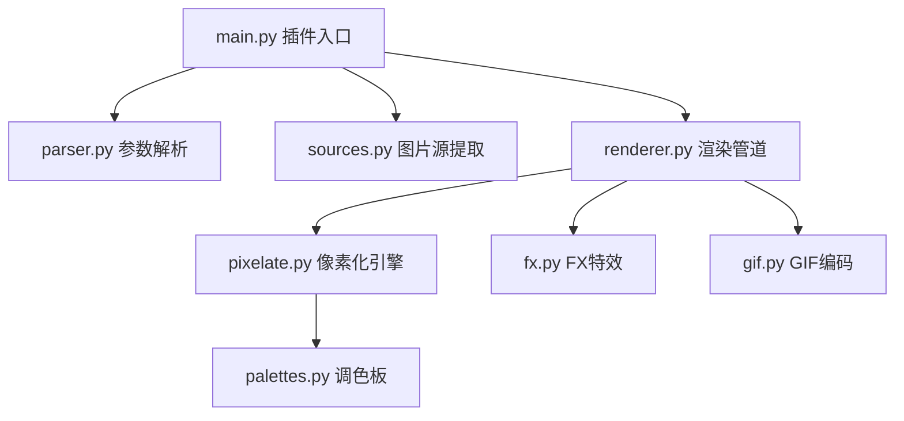

# AstrBot Pixel Converter Plugin

## 架构



## 核心数据流

```text
用户消息 -> parse_options() -> extract_image_url() -> process_image()
         -> pixelate() -> apply_fx() -> save PNG/GIF -> 发送结果
```

## 编码规范

- Python 3.12+，使用 `str | None` 风格 type hints
- 数据类用 `dataclasses.dataclass`
- 异步用 `async/await` + `asyncio.to_thread` 包装 CPU 密集任务
- 命名：模块/函数 `snake_case`，类 `PascalCase`，常量 `UPPER_SNAKE_CASE`
- 图像统一 RGBA 模式，alpha < 30 视为透明

## 修改指南

- **新调色板**：`core/palettes.py` 的 `PALETTES` 字典中添加 RGB 元组列表
- **新 FX**：`core/fx.py` 中实现函数，注册到 `STATIC_FX` 或 `ANIMATED_FX`，在 `apply_fx()` 添加分支
- **新配置项**：同时改 `_conf_schema.json` 和 `main.py` 加载逻辑
- **新平台**：改 `metadata.yaml` 的 `support_platforms`，确保 `core/sources.py` 兼容
- **版本号**：同时改 `metadata.yaml` 的 `version`（带 `v` 前缀）和 `main.py` `@register()` 中的版本字符串（不带前缀）
